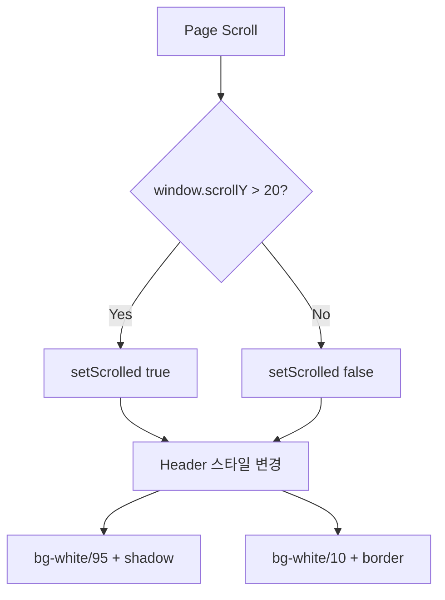
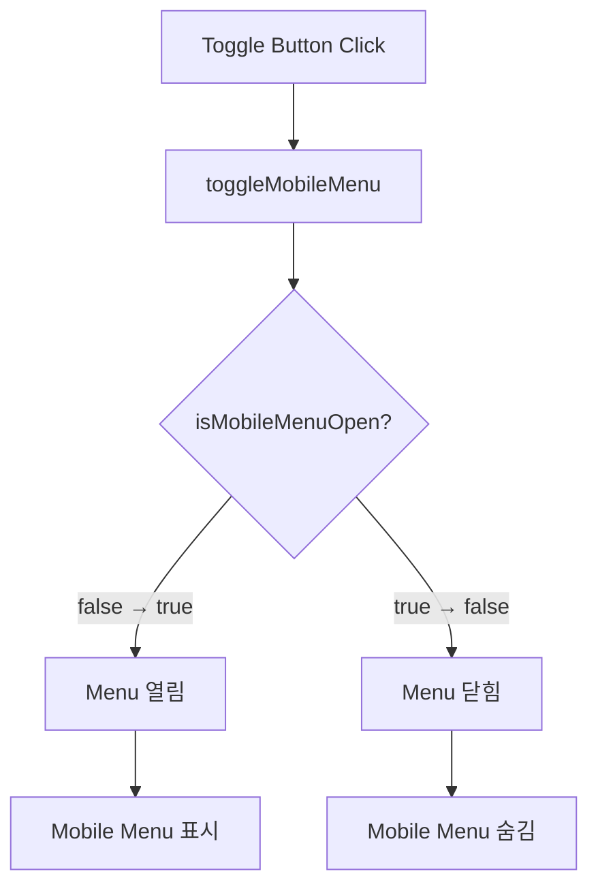
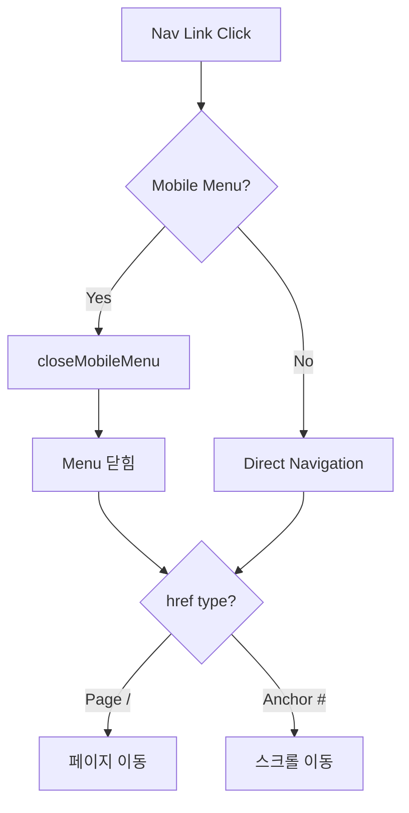
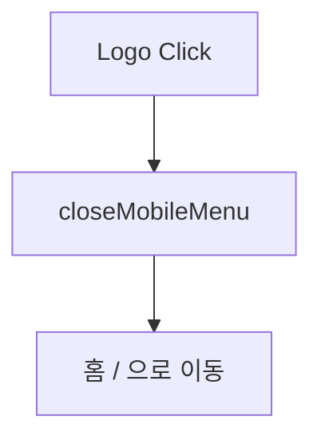
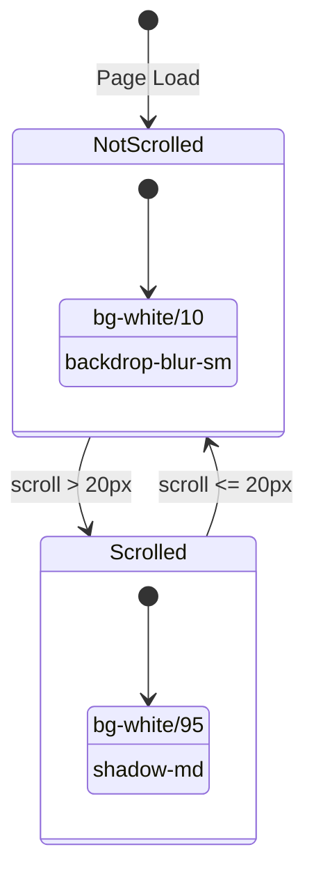
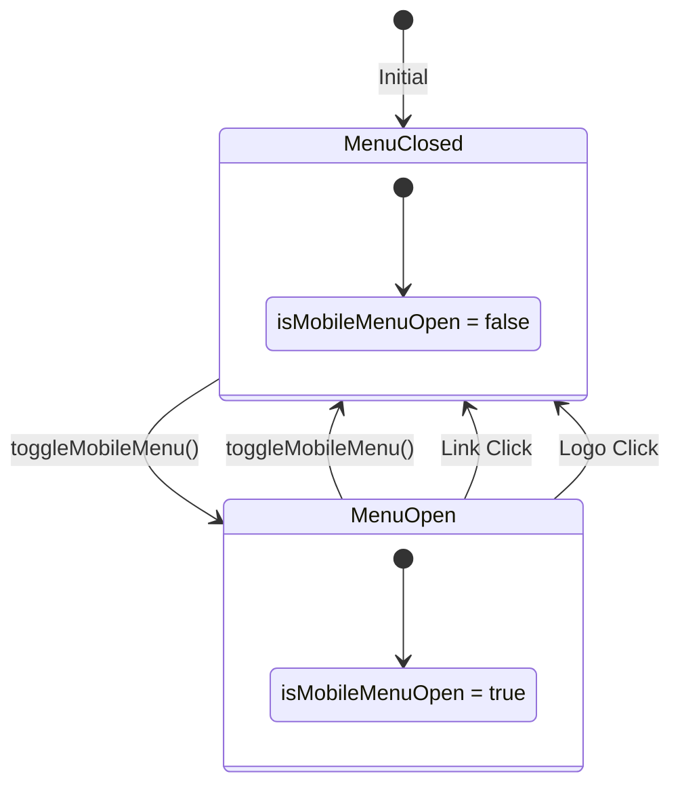
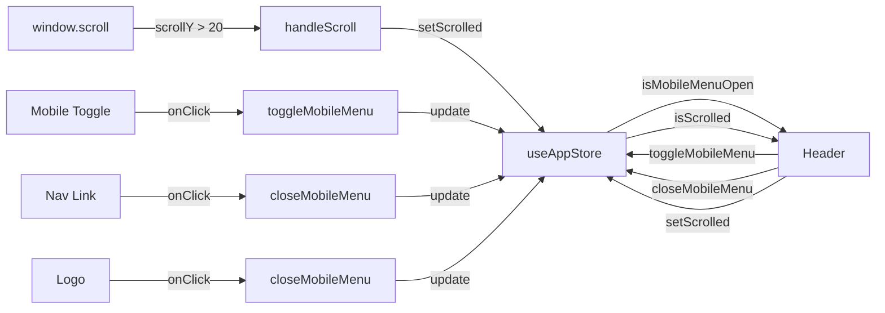

# Header 컴포넌트 와이어 맵

> **파일 경로**: `components/layout/Header.tsx`
> **생성일**: 2025-10-23
> **컴포넌트 타입**: Client Component ("use client")

---

## 📋 목차

1. [컴포넌트 개요](#컴포넌트-개요)
2. [의존성](#의존성)
3. [데이터 구조](#데이터-구조)
4. [상태 관리](#상태-관리)
5. [컴포넌트 구조](#컴포넌트-구조)
6. [스타일링 로직](#스타일링-로직)
7. [반응형 동작](#반응형-동작)
8. [이벤트 흐름](#이벤트-흐름)

---

## 컴포넌트 개요

Header는 웹사이트의 고정 네비게이션 바 컴포넌트입니다.

### 주요 기능
- ✅ 고정 헤더 (fixed positioning)
- ✅ 스크롤 감지 및 스타일 변경
- ✅ 반응형 디자인 (데스크톱/모바일)
- ✅ 모바일 햄버거 메뉴
- ✅ Glassmorphism 효과

---

## 의존성

### External Dependencies
```typescript
import Link from "next/link"              // Next.js 라우팅
import { useEffect } from "react"         // React Hook
import { Menu, X } from "lucide-react"    // 아이콘 (햄버거, 닫기)
```

### Internal Dependencies
```typescript
import { useAppStore } from "@/store/useAppStore"  // Zustand 전역 상태
import {
  NavigationMenu,                         // shadcn/ui 네비게이션
  NavigationMenuItem,
  NavigationMenuLink,
  NavigationMenuList,
  navigationMenuTriggerStyle,
} from "@/components/ui/navigation-menu"
```

---

## 데이터 구조

### Navigation Items
```typescript
const navItems = [
  { href: "/", label: "홈" },
  { href: "#services", label: "서비스" },
  { href: "/recommendations", label: "추천" },      // 🆕 신규 추가
  { href: "#projects", label: "프로젝트" },
  { href: "#about", label: "회사소개" },
  { href: "#contact", label: "문의하기" },
]
```

**타입 구조**:
```typescript
type NavItem = {
  href: string    // 페이지 경로 또는 앵커 링크
  label: string   // 화면에 표시될 텍스트
}
```

---

## 상태 관리

### Zustand Store (useAppStore)

```typescript
const {
  isMobileMenuOpen,    // boolean - 모바일 메뉴 열림/닫힘
  isScrolled,          // boolean - 스크롤 20px 이상 여부
  toggleMobileMenu,    // function - 모바일 메뉴 토글
  closeMobileMenu,     // function - 모바일 메뉴 닫기
  setScrolled          // function - 스크롤 상태 설정
} = useAppStore()
```

### useEffect - Scroll Listener

```typescript
useEffect(() => {
  const handleScroll = () => {
    setScrolled(window.scrollY > 20)  // 20px 이상 스크롤 시 true
  }

  window.addEventListener('scroll', handleScroll)
  return () => window.removeEventListener('scroll', handleScroll)
}, [setScrolled])
```

**동작 흐름**:
1. 컴포넌트 마운트 시 스크롤 이벤트 리스너 등록
2. 스크롤 발생 시 `window.scrollY` 체크
3. 20px 초과 시 `isScrolled = true`
4. 컴포넌트 언마운트 시 리스너 제거

---

## 컴포넌트 구조

### Visual Wireframe

```
┌─────────────────────────────────────────────────────────────────┐
│ <header> (Fixed Top, z-50)                                      │
│ ┌─────────────────────────────────────────────────────────────┐ │
│ │ Container (mx-auto px-4)                                    │ │
│ │ ┌─────────────────────────────────────────────────────────┐ │ │
│ │ │ Flex Row (justify-between)                              │ │ │
│ │ │                                                           │ │ │
│ │ │ ┌──────────┐         ┌──────────────┐     ┌──────────┐  │ │ │
│ │ │ │   Logo   │         │   Desktop    │     │  Mobile  │  │ │ │
│ │ │ │  (Link)  │         │     Nav      │     │  Toggle  │  │ │ │
│ │ │ │          │         │  (hidden     │     │ (lg:     │  │ │ │
│ │ │ │ [Image]  │         │    on        │     │ hidden)  │  │ │ │
│ │ │ │          │         │   mobile)    │     │          │  │ │ │
│ │ │ │ Faithful │         │              │     │ [☰] [✕]  │  │ │ │
│ │ │ └──────────┘         └──────────────┘     └──────────┘  │ │ │
│ │ └─────────────────────────────────────────────────────────┘ │ │
│ │                                                             │ │
│ │ ┌─────────────────────────────────────────────────────────┐ │ │
│ │ │ Mobile Menu (Conditional - isMobileMenuOpen)            │ │ │
│ │ │                                                           │ │ │
│ │ │ • 홈                                                      │ │ │
│ │ │ • 서비스                                                  │ │ │
│ │ │ • 추천                                                    │ │ │
│ │ │ • 프로젝트                                                │ │ │
│ │ │ • 회사소개                                                │ │ │
│ │ │ • 문의하기                                                │ │ │
│ │ └─────────────────────────────────────────────────────────┘ │ │
│ └─────────────────────────────────────────────────────────────┘ │
└─────────────────────────────────────────────────────────────────┘
```

### Component Tree

```
Header
├── <header> (fixed container)
│   └── <div> (container mx-auto)
│       ├── <div> (flex row)
│       │   ├── Logo Section
│       │   │   └── <Link href="/">
│       │   │       └──  (Faithful logo)
│       │   │
│       │   ├── Desktop Navigation (hidden lg:block)
│       │   │   └── <NavigationMenu>
│       │   │       └── <NavigationMenuList>
│       │   │           └── {navItems.map()}
│       │   │               └── <NavigationMenuItem>
│       │   │                   └── <NavigationMenuLink>
│       │   │                       └── <Link>
│       │   │
│       │   └── Mobile Toggle Button (lg:hidden)
│       │       └── <button onClick={toggleMobileMenu}>
│       │           └── {isMobileMenuOpen ? <X /> : <Menu />}
│       │
│       └── Mobile Menu (conditional)
│           └── {isMobileMenuOpen && (
│               <nav>
│                   <ul>
│                       {navItems.map()}
│                           <li>
│                               <Link onClick={closeMobileMenu}>
```

---

## 스타일링 로직

### Header Container Styles

```typescript
className={`fixed top-0 left-0 right-0 z-50 transition-all duration-300 ${
  isScrolled
    ? 'bg-white/95 backdrop-blur-md shadow-md'           // 스크롤됨
    : 'bg-white/10 backdrop-blur-sm border-b border-white/20'  // 최상단
}`}
```

#### 스크롤 전 (isScrolled = false)
- `bg-white/10` - 투명한 흰색 배경
- `backdrop-blur-sm` - 작은 블러 효과
- `border-b border-white/20` - 하단 테두리

#### 스크롤 후 (isScrolled = true)
- `bg-white/95` - 거의 불투명한 흰색 배경
- `backdrop-blur-md` - 중간 블러 효과
- `shadow-md` - 그림자 효과

### Navigation Link Styles

```typescript
className={`${navigationMenuTriggerStyle()} font-medium transition-all ${
  isScrolled
    ? 'text-muted-foreground hover:text-primary'        // 스크롤됨
    : 'text-foreground hover:bg-white/10 drop-shadow-lg'  // 최상단
}`}
```

### Mobile Toggle Button Styles

```typescript
className={`lg:hidden p-2 rounded-lg transition-all ${
  isScrolled
    ? 'text-muted-foreground hover:bg-muted'            // 스크롤됨
    : 'text-foreground hover:bg-white/10 drop-shadow-lg'  // 최상단
}`}
```

---

## 반응형 동작

### Breakpoint: `lg` (1024px)

| 화면 크기 | Logo | Desktop Nav | Mobile Toggle | Mobile Menu |
|----------|------|-------------|---------------|-------------|
| **Mobile** (< 1024px) | ✅ 표시 | ❌ 숨김 | ✅ 표시 | 조건부 표시 |
| **Desktop** (≥ 1024px) | ✅ 표시 | ✅ 표시 | ❌ 숨김 | ❌ 숨김 |

### Height Responsive

```css
h-16        /* Mobile: 64px */
lg:h-20     /* Desktop: 80px */
```

### Logo Size Responsive

```css
h-12        /* Mobile: 48px */
lg:h-14     /* Desktop: 56px */
```

---

## 이벤트 흐름

### 1. 스크롤 이벤트 흐름



### 2. 모바일 메뉴 토글 흐름



### 3. 네비게이션 클릭 흐름



### 4. 로고 클릭 흐름



---

## 상태 다이어그램





---

## 데이터 흐름 다이어그램



---

## 성능 최적화

### 1. 이벤트 리스너 정리
```typescript
useEffect(() => {
  // ...
  return () => window.removeEventListener('scroll', handleScroll)
}, [setScrolled])
```
- 메모리 누수 방지
- 컴포넌트 언마운트 시 자동 정리

### 2. CSS Transitions
```css
transition-all duration-300
```
- 부드러운 스타일 전환
- 300ms 애니메이션

### 3. Conditional Rendering
```typescript
{isMobileMenuOpen && (
  <nav>...</nav>
)}
```
- 필요할 때만 DOM 생성
- 초기 렌더링 성능 향상

---

## 접근성 (Accessibility)

### 1. Semantic HTML
- `<header>` 태그 사용
- `<nav>` 태그 사용
- `<button>` 태그 사용

### 2. ARIA Labels
```typescript
aria-label="메뉴 토글"
```

### 3. Alt Text
```typescript
alt="Faithful"
```

### 4. Keyboard Navigation
- 모든 링크와 버튼은 키보드로 접근 가능
- Tab 키로 순차 이동 가능

---

## 개선 가능한 영역

### 1. 이미지 최적화
```typescript
// 현재


// 권장
<Image src="/logo.png" alt="Faithful" width={56} height={56} />
```

### 2. Active Link 표시
```typescript
// navItems에 현재 경로 확인 로직 추가
const isActive = pathname === item.href
```

### 3. Sticky Navigation 개선
```typescript
// Intersection Observer API 사용
// 더 정밀한 스크롤 감지 가능
```

---

## 관련 파일

- **Store**: `store/useAppStore.ts`
- **UI Components**: `components/ui/navigation-menu.tsx`
- **Icons**: `lucide-react`
- **Styles**: `app/globals.css`

---

## 버전 히스토리

| 버전 | 날짜 | 변경 사항 |
|------|------|-----------|
| 1.1 | 2025-10-23 | 추천 메뉴 항목 추가 (`/recommendations`) |
| 1.0 | - | 초기 버전 (5개 메뉴 항목) |

---

**문서 작성**: Claude Code
**마지막 업데이트**: 2025-10-23
